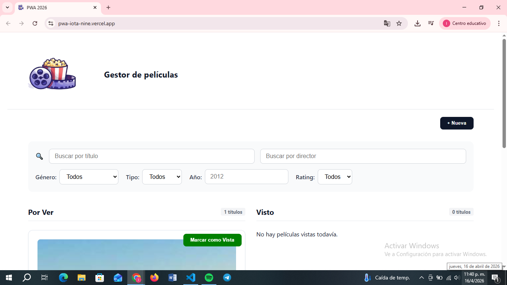
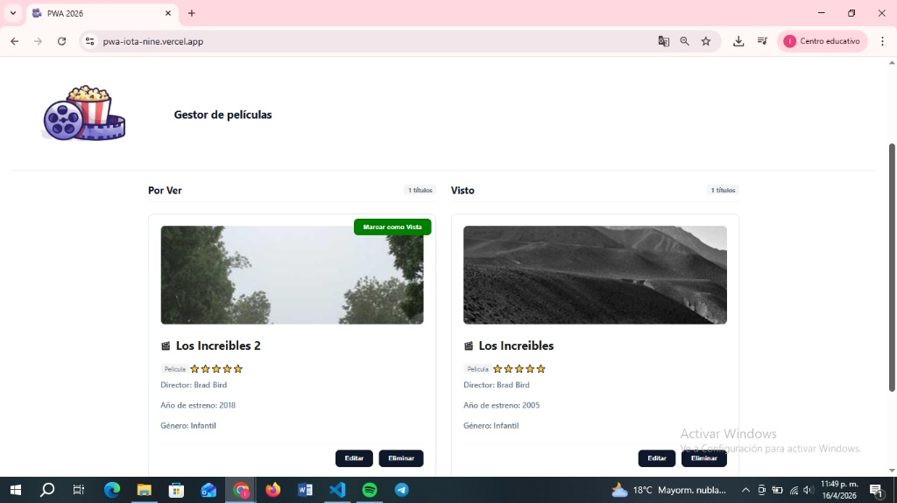
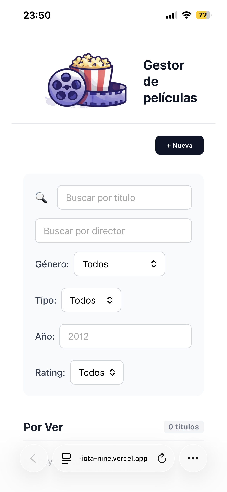

# 🎬 PWA - Catálogo de Películas y Series

Es un gestor de peliculas y series desarrollada con **React** y **Vite**. La aplicación permite navegar por un catálogo de películas, ver detalles y disfrutar de una interfaz optimizada para dispositivos móviles y escritorio.

## 📸 Vista Previa del Proyecto

A continuación se muestran capturas de pantalla de la interfaz:

### Pantalla Principal
Aquí es donde se listan todas las películas y series disponibles.

### Tarjetas "Por ver" y "Visto"
Se visualizan tarjetas con peliculas y series, con su nombre, rating, año, director, genero e imagen.

### Versión Mobile (PWA)
Así se ve la aplicación instalada en un celular.

## 🛠️ Tecnologías Utilizadas

* **React** (Frontend Library)
* **Vite** (Build Tool)
* **React Icons** (Iconografía)
* **CSS3** (Estilos personalizados)
* **Vercel** (Despliegue y Hosting)

---

## 🚀 Instalación y Configuración Local

Si querés correr este proyecto en tu computadora, seguí estos pasos:

### 1. Clonar el repositorio
git clone https://github.com/sol-bruschi/PWA.git

### 2. Instalar las dependencias
npm install

### 3. Ejecutar el proyecto en desarrollo
npm run dev

### 4. Generar la versión de producción
npm run build